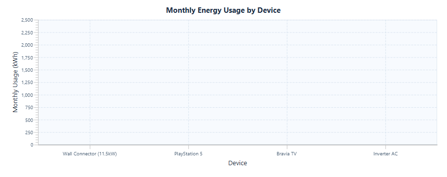

<h1 align="center">⚡ PowerGuard</h1>

<p align="center">
  <b>A JavaFX desktop app that predicts your electricity bill and helps you stay within budget.</b>
</p>

<p align="center">
  
  
  
</p>

<!-- Add screenshots of the dashboard and the prediction screen:
<p align="center"></p>
-->

## What it does

PowerGuard estimates a household's electricity bill in two ways: from the number of units consumed, or from the appliances you use. It tracks your spending against a budget and exports a usage report.

## Features

- **Two prediction modes:** enter units directly, or choose company, appliance, quantity and daily usage hours
- **Five screens** with user login
- **Budget tracking:** compare predicted bills with your monthly budget
- **Model benchmarking:** five machine learning models are trained and compared, and the best one is selected automatically
- **PDF export** of the usage report

## How the models were trained

- 10,000 records, split 8,000 for training and 2,000 for testing
- Five models benchmarked on the same split, with automatic selection of the best performer

## Requirements

PowerGuard is not a clone-and-run project. You need to set up:

- A JDK (use the version the project was built with)
- The JavaFX SDK
- The Weka machine learning library
- The other library dependencies the project imports

<!-- Add exact versions here, for example: JDK 21, JavaFX 21, Weka 3.8 -->

## Run it

1. Clone the repository.
2. Open the `powerguard` folder in IntelliJ IDEA.
3. Add the JavaFX SDK and Weka as libraries and set the project JDK.
4. Run the application's main class.

```bash
git clone https://github.com/Mohd-Hanan/AP-PROJECT.git
```

## Sample output

<p align="center"></p>

## Team

Built as a four-person team project.
